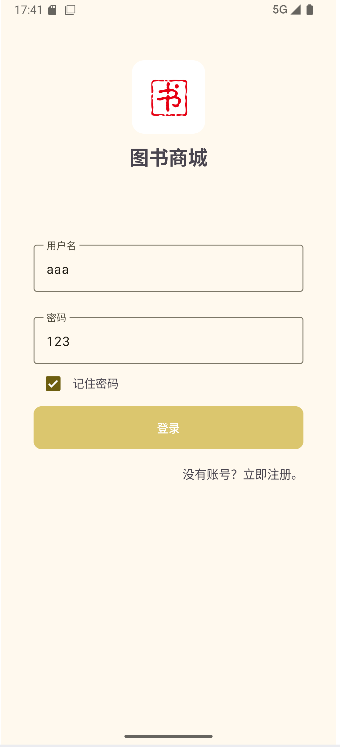
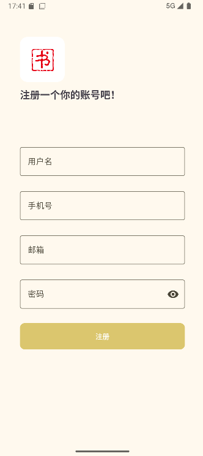
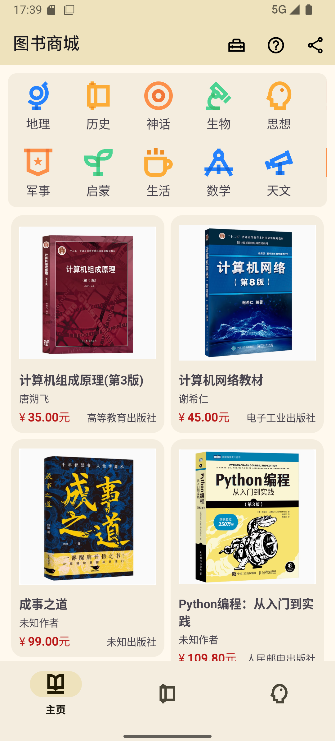
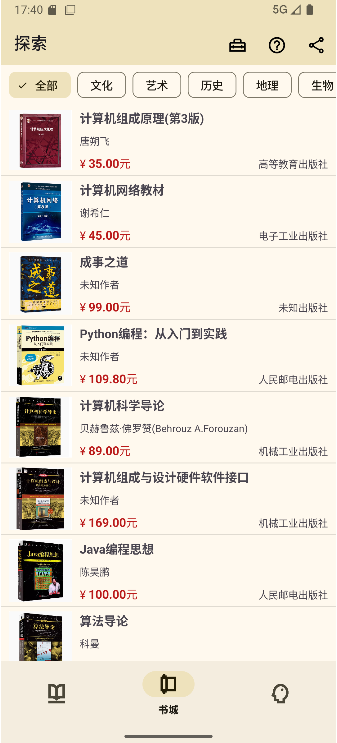
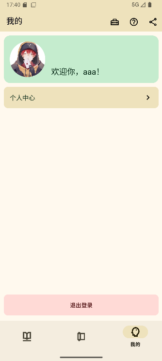
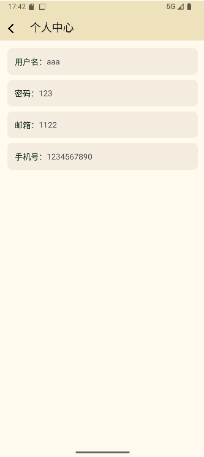

# BookMall - 图书商城Android应用
（大三安卓课程期末大作业）<br><br>
一个基于Android平台的图书商城应用，提供图书浏览、分类查询、用户管理等功能。

## 📱 功能特性

### 核心功能
- **首页展示**：以网格布局展示热门图书，支持分类筛选
- **图书列表**：提供完整的图书目录，支持列表形式浏览
- **用户系统**：支持用户注册、登录和个人信息管理
- **图书分类**：提供丰富的图书分类标签，方便用户快速找到感兴趣的书籍
- **分享功能**：支持将应用分享给好友

### 用户体验
- 响应式设计，适配不同屏幕尺寸
- 流畅的动画效果和界面过渡
- 直观的导航结构，易于操作

## 🛠 技术栈

### 开发语言
- **Kotlin**：主要开发语言，现代、安全、高效
- **Java**：部分功能模块使用

### Android框架与组件
- **Jetpack**：
  - ViewBinding：简化视图绑定
  - Room：本地数据库存储
  - Fragment：模块化UI组件
  - RecyclerView：高效展示列表数据
- **Material Design**：现代UI设计规范，提供美观的界面组件
- **ViewPager2**：实现页面切换和滑动效果

### 数据库
- **Room**：轻量级ORM框架，用于用户数据的本地存储

## 📁 项目结构

```
├── app/src/main/java/cn/xiaosuli/bookmall/
│   ├── App.kt                      # 应用入口类
│   ├── database/                   # 数据库相关
│   │   ├── AppDatabase.kt          # Room数据库定义
│   │   ├── User.kt                 # 用户实体类
│   │   └── UserDao.kt              # 用户数据访问接口
│   ├── model/                      # 数据模型
│   │   ├── BookItem.java           # 图书数据模型
│   │   └── ToolbarItem.java        # 工具栏项模型
│   ├── adapter/                    # 适配器
│   │   ├── BookLvAdapter.java      # 图书列表适配器
│   │   ├── BookRvAdapter.kt        # 图书网格适配器
│   │   └── ToolbarAdapter.kt       # 分类工具栏适配器
│   └── ui/                         # 界面组件
│       ├── MainActivity.kt         # 主活动
│       ├── HomeFragment.kt         # 首页Fragment
│       ├── BookListFragment.java   # 图书列表Fragment
│       ├── MineFragment.kt         # 个人中心Fragment
│       ├── LoginActivity.kt        # 登录界面
│       ├── RegisterActivity.kt     # 注册界面
│       └── UserInfoActivity.kt     # 用户信息界面
```

## 🚀 快速开始

### 环境要求
- Android Studio 4.0+
- Android SDK 25+
- Kotlin 1.5+
- Java 17+

### 安装与运行

1. **克隆项目**
   ```bash
   git clone https://github.com/xiaosuli2003/BookMall.git
   ```

2. **打开项目**
   - 使用Android Studio打开项目
   - 等待Gradle同步完成

3. **构建与运行**
   - 连接Android设备或启动模拟器
   - 点击"Run"按钮构建并运行应用

## 📸 项目截图

### 登录与注册
| 登录界面 | 注册界面 |
|---------|---------|
|  |  |

### 主界面功能
| 首页 | 图书列表 | 个人中心 |
|-----|---------|---------|
|  |  |  |

### 用户管理
| 用户信息 |
|---------|
|  |

## 📖 使用说明

### 首次使用
1. 打开应用，进入首页
2. 点击底部导航栏切换不同功能模块
3. 点击"我的"进入个人中心
4. 点击"登录/注册"按钮完成用户认证

### 浏览图书
1. 在首页以网格形式浏览图书
2. 点击顶部分类标签筛选特定类型的图书
3. 切换到"图书列表"页面查看完整目录

### 用户管理
1. 在"我的"页面查看个人信息
2. 点击头像或用户名进入用户信息编辑页面
3. 可以修改头像、昵称等个人信息

## 📄 许可证

本项目采用 Apache 2.0 许可证，详情请查看 [LICENSE](LICENSE) 文件。

## 📧 联系方式

如有问题或建议，欢迎通过以下方式联系我们：

- Email: xiaosuli2003@qq.com
- GitHub Issues: [提交问题](https://github.com/xiaosuli2003/BookMall/issues)

## 🌟 致谢

感谢所有为项目做出贡献的开发者和用户！

---

**BookMall** - 让阅读更简单！